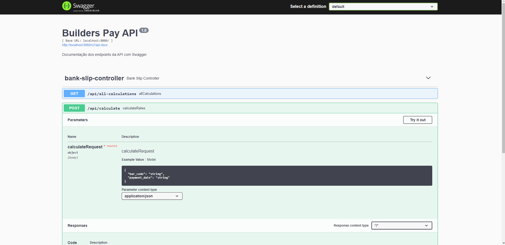

<h1> Builders-Pay 🧾 </h1>

### Api developed for Builders technical challenge.

## Stack 📌
+ JDK 17
+ Mongo, mongo compass;
+ Lombok;

If you prefer to use docker or an IDE, in my case I used intellij.

## Preparing the environment 🖥️
+ Create database "builderspay"

+ Por padrão, o lombok já vem nos plugins do maven, mas caso seja necessário uma instalação aqui está o link para obter o jar.
<p><a href="https://projectlombok.org/downloads/lombok.jar">Lombok</a></p>

## Commands ✅

First you perform a ```mvn clean``` and then a ```mvn install``` to run through the IDE, just run the BuilderPayApplication.class, but to run with docker perform
```docker build -t "builderspay" .``` and then a ```docker-compose up -d```.

## Documentation 📋
<p><a href="http://localhost:8080/swagger-ui/index.html">Swagger</a></p>
<p align="center">

</p>

## Tests 📈

The api has 2 endpoints
+ /calculate (POST)
+ /all-calculations (GET)

For testing, a collection is available using Postman.
<p><a href="./complement/Builders Pay.postman_collection.json">Collection</a></p>

And a csv file with the test mass used
<p><a href="Data.csv">Data</a></p>

Example with a valid input
<p align="center">

</p>

Example with an invalid entry
<p align="center">

</p>
